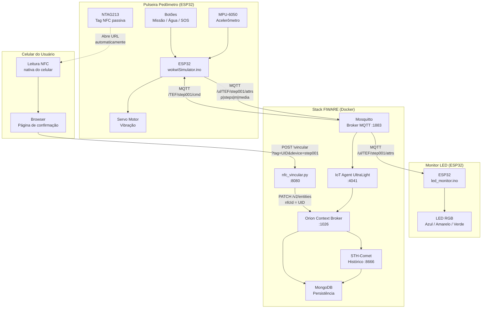
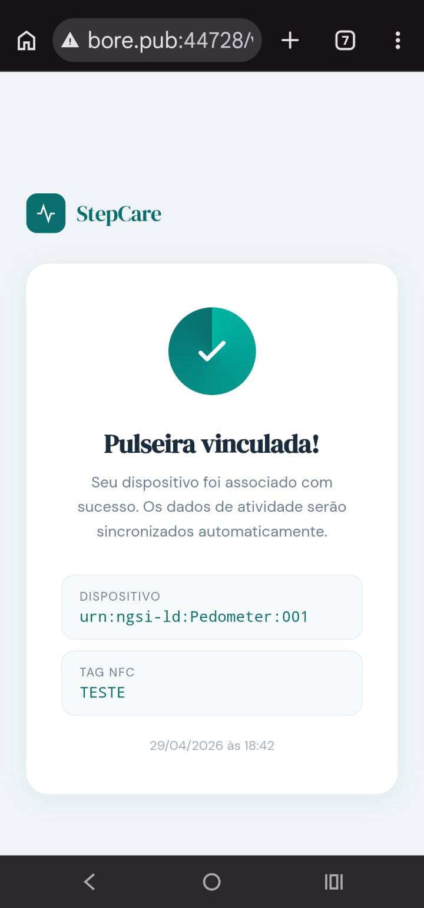

# Pedômetro Care Plus

Solução IoT de monitoramento de atividade física baseada em ESP32, integrada ao FIWARE via MQTT. O sistema é composto por três módulos independentes: a pulseira pedômetro, o monitor LED de atividade e o vínculo NFC para identificação do usuário.

---

## Arquitetura



---

## Módulos

### 1. Pulseira Pedômetro (`wokwiSimulator.ino`)
ESP32 com acelerômetro MPU-6050. Detecta passos, calcula média de passos por minuto, controla vibração por servo motor e gerencia botões de interação. Publica dados no broker MQTT e integra ao FIWARE via IoT Agent UltraLight.

### 2. Monitor LED (`led_monitor.ino`)
ESP32 independente com LED RGB. Recebe `steps_per_minute` via MQTT e indica visualmente o nível de atividade por cor:

| Faixa | Cor | Significado |
|-------|-----|-------------|
| 0 p/min | Apagado | Sem atividade |
| 1–10 p/min | Azul | Atividade baixa |
| 11–20 p/min | Amarelo | Atividade média |
| 21+ p/min | Verde | Meta atingida |

### 3. Vínculo NFC (`nfc_vincular.py`)
Servidor web Python que recebe a leitura de uma tag NTAG213 pelo celular do usuário e registra o vínculo `UID <-> dispositivo` no Orion Context Broker. O celular abre a página automaticamente ao encostar na tag — sem app necessário.

---

## Hardware

### Pulseira Pedômetro

| Componente | Especificação |
|------------|--------------|
| Microcontrolador | ESP32 DevKit V1 |
| Acelerômetro | MPU-6050 (I2C) |
| Atuador | Servo Motor |
| Botões | 4x push button |
| Tag NFC | NTAG213 (passiva) |

### Monitor LED

| Componente | Especificação |
|------------|--------------|
| Microcontrolador | ESP32 DevKit V1 |
| LED | RGB cátodo comum |
| Resistores | 3x 220 Ohm |

---

## Pinagem

### Pulseira Pedômetro

| Pino | Função |
|------|--------|
| GPIO 21/22 | MPU-6050 (SDA/SCL) |
| GPIO 19 | Servo Motor |
| GPIO 25 | Botão Missão OK |
| GPIO 32 | Botão Missão Saiu |
| GPIO 33 | Botão Água |
| GPIO 26 | Botão SOS |

### Monitor LED

| Pino | Função |
|------|--------|
| GPIO 25 | LED RGB Vermelho |
| GPIO 26 | LED RGB Verde |
| GPIO 27 | LED RGB Azul |

---

## Tópicos MQTT

| Tópico | Direção | Conteúdo |
|--------|---------|---------|
| `/ul/TEF/step001/attrs` | ESP32 -> Broker | `p\|passos\|m\|media` |
| `/TEF/step001/cmd` | Broker -> ESP32 | Comandos (ex: `step001@agua\|`) |

---

## Stack FIWARE

| Serviço | Porta | Função |
|---------|-------|--------|
| Orion Context Broker | 1026 | Gerenciamento de entidades |
| IoT Agent UltraLight | 4041 | Tradução MQTT -> NGSI |
| STH-Comet | 8666 | Histórico de dados |
| Mosquitto | 1883 | Broker MQTT |
| MongoDB | 27017 | Persistência |
| nfc_vincular.py | 8080 | Vínculo NFC -> Orion |

### Executar o stack completo

```bash
docker-compose up -d
```

> O serviço `nfc-vincular` é buildado localmente a partir do `Dockerfile` incluído no repositório. Os demais serviços utilizam imagens públicas.

### Variáveis de ambiente — nfc_vincular

| Variável | Padrão | Descrição |
|----------|--------|-----------|
| `FIWARE_IP` | `35.247.231.140` | IP ou hostname do Orion |
| `ORION_PORT` | `1026` | Porta do Orion |
| `SERVER_PORT` | `8080` | Porta do servidor NFC |

---


### Vínculo NFC
```
Celular encosta na pulseira (NTAG213)
→ browser abre GET /vincular?tag=UID&device=urn:ngsi-ld:Pedometer:001
→ exibe página de confirmação
→ usuário clica "Confirmar vínculo"
→ browser envia POST /vincular (body: tag + device)
→ nfc_vincular.py faz PATCH no Orion
→ atributo nfcId atualizado com UID + timestamp
→ browser exibe confirmação de sucesso
```

### LED Monitor
```
ESP32 LED subscreve /ul/TEF/step001/attrs via MQTT
→ extrai campo m| (steps_per_minute)
→ 0 p/min       → LED apagado
→ 1–10 p/min    → LED azul (baixo esforço)
→ 11–20 p/min   → LED amarelo (esforço médio)
→ 21+ p/min     → LED verde (meta atingida)
```

---

## Interface de Vínculo NFC

Quando o celular encosta na pulseira, o browser abre automaticamente a interface StepCare.

### Tela de confirmação
O usuário visualiza o dispositivo detectado e confirma o vínculo.


### Tela de sucesso
Após confirmar, o sistema registra o vínculo no Orion e exibe a confirmação com dispositivo, tag NFC e horário.



---

## Entidade FIWARE

```
ID:   urn:ngsi-ld:Pedometer:001
Tipo: Pedometer
```

| Atributo | Tipo | Descrição |
|----------|------|-----------|
| `steps` | Integer | Passos totais na janela |
| `steps_per_minute` | Float | Média de passos por minuto |
| `button_event` | Text | Último evento de botão |
| `nfcId` | Text | UID da tag NFC vinculada |

---

## Simulação

| Módulo | Link |
|--------|------|
| Pulseira Pedômetro | [Wokwi - Pedômetro](https://wokwi.com/projects/459859530710556673) |
| Monitor LED | Projeto separado — usar `led_monitor.ino` + `diagram.json` |

> O componente MFRC522 exibido no diagrama da pulseira representa a tag NTAG213 passiva. Tags NFC não se conectam ao ESP32 — a leitura é feita pelo celular do usuário.

---

## Modificações em relação ao projeto base

Este projeto é derivado do [FIWARE Descomplicado](https://github.com/fabiocabrini/fiware.git) do Prof. Fábio Henrique Cabrini. As seguintes modificações foram realizadas:

- `docker-compose.yml` — adicionado o serviço `nfc-vincular` (porta 8080)
- `Dockerfile` — imagem customizada Python 3.11 para o servidor NFC
- Nenhuma alteração nas imagens Docker originais do FIWARE

---
# Créditos

Este projeto é uma variação do **[FIWARE Descomplicado](https://github.com/fabiocabrini/fiware)**, desenvolvido pelo **Prof. Fábio Henrique Cabrini** da FIAP. O projeto original fornece a infraestrutura base para integração de dispositivos IoT com a plataforma FIWARE, utilizando MQTT, Orion Context Broker e IoT Agent UltraLight.

A partir dessa base, foram adicionados os módulos de pedômetro com ESP32, vínculo de usuário via NFC e monitor LED de atividade física. Todo o crédito pela arquitetura e stack FIWARE é do professor.

> Repositório original: [github.com/fabiocabrini/fiware](https://github.com/fabiocabrini/fiware)
---
## Autores

| Nome | Função |
|------|--------|
| Prof. Fábio Henrique Cabrini | Código base e FIWARE Descomplicado |
| Gabriel Ardito | Desenvolvimento |
| Felipe Menezes | Desenvolvimento |
| João Sarracine | Desenvolvimento |
| João Gonzales | Desenvolvimento |
